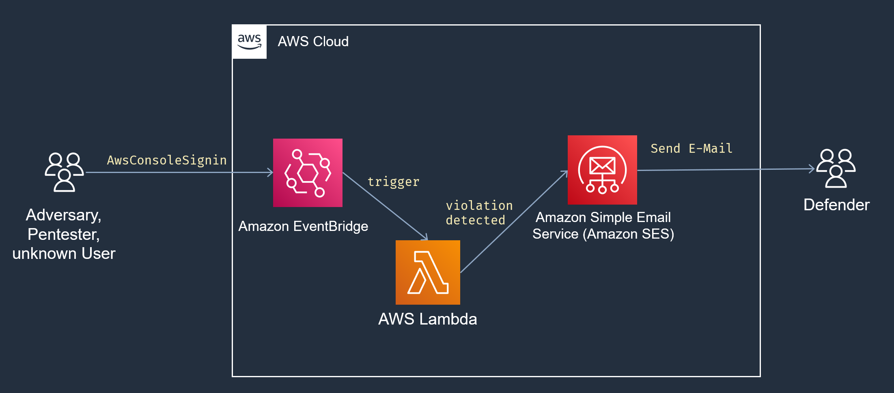

# AWS-LoginGuard

> Ever wondered who is lurking around in your AWS Account? Get notified if someone strange is login into your AWS Account

If the event `AwsConsoleSignin` get's triggered, the Event Bridge shall trigger a lambda function that gathers some info about "who is logging in" and try to check if it's a Pentester. Most of the guys are forgetting to disguise their user agents. In this first version we stay "detective", in later version also an automatic remediation could be implemented. Let's see how this script evolves :)

### Todo:
1. Make a fancier readme
2. Add a Terraform Script to deploy everything
